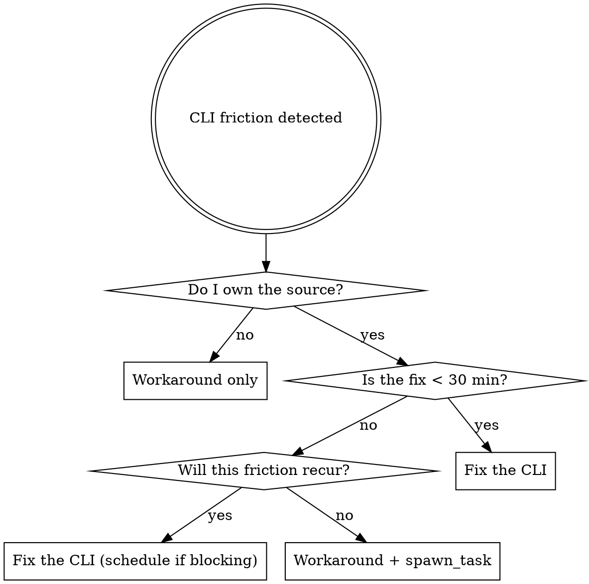

# CLI Self-Improvement

When the `sea` CLI causes friction — errors, missing features, bad output, awkward UX — fix the tool rather than working around it. You own the source. Workarounds accumulate; fixes compound.

## The Decision



**Default to fixing.** The fix threshold is generous because the CLI infrastructure already exists — Commander commands, lib functions, build pipeline, test suite. Most improvements slot into established patterns.

## Friction Categories

| Friction | Example | Fix target |
|----------|---------|------------|
| **Error / crash** | Command fails on valid input | Bug in CLI or lib |
| **Missing feature** | No `rename-tag` command; resort to sed | New command or subcommand |
| **Noisy output** | `drift` shows all files, not just mismatches | Filter, `--json`, exit codes |
| **Wrong defaults** | Must always pass `--dir entities` to avoid false positives | Fix inference logic |
| **Missing automation hooks** | No exit code for CI/scripts | Exit 1 on findings |
| **Format gap** | Can't pipe output to jq | Add `--json` flag |

## How to Fix

### 1. Locate the code

| Layer | Path | Contains |
|-------|------|----------|
| CLI commands | `packages/cli/src/commands/` | Commander wiring, argument parsing, output formatting |
| Shared logic | `packages/lib/src/` | Core functions (frontmatter, path-inference, vault, taxonomy) |
| Exports | `packages/lib/src/index.ts` | Public API — new lib functions must be re-exported here |
| Tests | `packages/lib/tests/` | Vitest tests for lib modules |

Logic goes in **lib**. CLI commands are thin wrappers that parse args, call lib, format output.

### 2. Make the change

Follow existing patterns — read a similar command/function first. For new commands:

```
1. Add function to packages/lib/src/<module>.ts
2. Export from packages/lib/src/index.ts
3. Add Commander subcommand in packages/cli/src/commands/<file>.ts
4. Wire into packages/cli/src/cli.ts
```

### 3. Build and verify

```bash
pnpm build          # build lib + cli
pnpm typecheck      # catch type errors
pnpm test:lib       # run existing tests
# then test manually:
node packages/cli/dist/cli.js <your-command> --dry-run
```

Add a test in `packages/lib/tests/` if the change touches lib logic.

**If the build fails:** Debug it. Type errors and test failures after a CLI change are almost always small mistakes (missing import, wrong return type). Do not revert and fall back to a workaround — that's rationalizing. Fix the build error, it's usually one line.

### 4. Commit separately

Use `feat:` for new features, `fix:` for bug fixes. CLI improvements get their own commit, separate from the task that triggered them. This keeps the git history clean — the tool improvement stands on its own.

## Red Flags — You're Rationalizing a Workaround

| Thought | Reality |
|---------|---------|
| "I'm here to do X, not improve tooling" | The tool is how you do X. Fix it and X gets easier forever. |
| "grep/sed is faster right now" | Faster once. The CLI runs hundreds of times. |
| "It works well enough with --dir" | "Well enough" means every future user needs the same tribal knowledge. |
| "This is a one-off task" | The CLI is never one-off. Other agents, hooks, and the DM all use it. |
| "The fix would take too long" | Check: most CLI fixes take 10-20 min given existing scaffolding. |
| "I'll come back and fix it later" | You won't. Fix it now or `spawn_task` it. |
| "The build failed, so the fix is too hard" | Build failures after a small change are usually one-line fixes. Debug it. |
| "I'll just bundle it into the task commit" | CLI improvements stand alone. Separate commit, separate rationale. |

## When a Workaround IS Correct

- You don't own the tool (external dependency)
- The fix requires an architectural redesign (> 1 hour)
- Genuine urgency — the DM needs the answer right now for an active session

Even in these cases: **log the friction.** Use `spawn_task` to create a chip for the CLI fix so it doesn't get lost.
