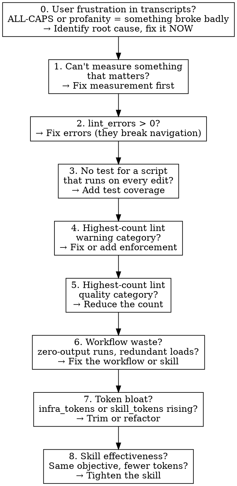

# The Six-Step Loop — Detailed Procedures

This reference expands each step of the CSI loop:

```
MEASURE → IDENTIFY → FIX → ENFORCE → VERIFY → LOG
```

All six steps run, in order, every run. Skipping any step — especially MEASURE
or VERIFY — invalidates the run.

---

## Step 1 — MEASURE (mandatory, never skip)

Take an objective health snapshot before doing anything else:

```bash
sea health --save --label "before: CSI run"
```

If this script doesn't exist or fails, **that is your issue for this run.**
Build or fix the measurement infrastructure before attempting any other
improvement. You cannot improve what you cannot measure.

Record the snapshot output. You will compare against it in VERIFY.

### What the snapshot captures

**Vault health (static):**

| Metric | Source | Why it matters |
|---|---|---|
| `file_count` | filesystem | Vault growth tracking |
| `total_tokens` / `mean_file_tokens` | char count / 4 | Context budget pressure |
| `lint_errors` | sea lint | Broken navigation, invalid values |
| `lint_warnings` | sea lint | Standards drift |
| `lint_quality` | sea lint | Improvement opportunities |
| `lint_by_category` | sea lint | Where the pain concentrates |
| `orphan_count` / `deadend_count` | sea lint | Graph connectivity |
| `stub_summaries` | frontmatter scan | Routing quality (vague summaries = bad routing) |
| `pending_ingest` | check_ingest.py | Backlog pressure |
| `hook_count` | settings.json | Enforcement coverage |
| `script_test_count` | filesystem | Infrastructure reliability |
| `scripts_tested` | filesystem | Test coverage ratio (e.g. "2/10") |
| `scripts_without_tests` | filesystem | Which scripts lack tests |
| `infra_inventory` | full scan | Per-file breakdown of all scripts, skills, hooks, rules |

**Infrastructure cost (static):**

| Metric | Source | Why it matters |
|---|---|---|
| `infra_tokens` | skills + scripts + hooks + CLAUDE.md | Total token cost of infrastructure |
| `skill_tokens` / `skill_count` | SKILL.md files | Token efficiency of skills |
| `claudemd_tokens` | CLAUDE.md | Cost of always-loaded instructions |

**Workflow effectiveness (from daily-log):**

| Metric | Source | Why it matters |
|---|---|---|
| `daily_runs_total` | daily-log.md | How often the daily-update runs |
| `daily_runs_zero_output` | daily-log.md | Runs that consumed tokens but changed nothing |
| `daily_ingest_total` | daily-log.md | Sources processed across all logged runs |
| `daily_lint_fixes_total` | daily-log.md | Files auto-fixed across all logged runs |
| `daily_crosslinks_total` | daily-log.md | Links added across all logged runs |

The workflow metrics parse `wiki/dm/daily-log.md` to measure what autonomous
runs actually produce. A run that loads skills, checks the vault, and changes
nothing is a wasted run — it consumed tokens for zero output. If
`daily_runs_zero_output` is high relative to `daily_runs_total`, the
daily-update skill or its schedule needs adjustment.

### Token efficiency as a quality signal

Leaner infrastructure that achieves the same results is better — every token
in CLAUDE.md, skills, and scripts is loaded into context and competes with
content for the agent's attention. If a skill can be made shorter without
losing effectiveness, that's an improvement. If a skill becomes longer but
the agent follows it more reliably, that's also an improvement. Use
`infra_tokens` and `skill_tokens` to track this over time.

The inventory breaks down token costs per-skill and per-script, so you can
identify bloated components. A skill with 8000 tokens should justify that
weight; one with 500 tokens that does the same job is strictly better.

### If you can't measure it, fix that first

If the snapshot script is missing, broken, or missing a metric you need to
evaluate your proposed fix — **building or extending the measurement tool IS
your improvement for this run.** This is not a failure; it is the highest-impact
work possible, because every future run depends on it.

---

## Step 2 — IDENTIFY (one problem, highest impact)

Analyze the snapshot to find the single highest-impact issue. Then mine session
history for workflow-level problems the snapshot can't see.

### 2a. Read the snapshot

The snapshot numbers are the primary signal for priorities 1–5 and 7–8.

### 2b. Mine session transcripts

Spawn a subagent to search session transcripts for workflow waste patterns
and user frustration signals. The subagent should query
`mcp__ccd_session_mgmt__search_session_transcripts` with 3–5 targeted
searches:

**Frustration signals (priority 0 — always search for these first):**

- ALL-CAPS user messages — search for distinctive all-caps phrases or words
  that indicate frustration (e.g., `"STOP"`, `"WHY"`, `"WRONG"`, `"BROKEN"`)
- Profanity or strong language from the user

If the subagent finds frustration signals, it must extract the root cause:
what was the user upset about? What agent behavior or infrastructure failure
triggered it? That root cause becomes the issue for this run at priority 0,
overriding everything else in the priority stack.

**Workflow waste patterns:**

- `"no work found"` or `"nothing to do"` — wasted autonomous runs
- `"skill"` + a specific skill name — to check if a skill is loaded but unused
- `"re-reading"` or `"already read"` — redundant file reads
- Error messages or rationalizations that recur across sessions

The subagent returns a short summary: which patterns appeared, how many
sessions, one-line quotes. Frustration signals feed priority 0; waste patterns
feed priority 6. If no transcript evidence exists, skip to snapshot-only
identification.

**Scheduled/autonomous runs:** Transcript search requires interactive MCP
approval and is unavailable in scheduled routines. Skip step 2b and start
the priority stack at P1. Priority 0 only fires during interactive runs.

### 2c. Check daily-log trends

Scan `wiki/dm/daily-log.md` for patterns across recent entries: zero-output
runs, declining throughput, recurring errors. The snapshot's `daily_*` metrics
quantify this, but reading the log entries gives context the numbers miss.

### Priority stack

Use this priority stack:



**Rules for identification:**

- **One problem per run.** Not two. Not "while I'm here." One.
- **Priority 0 overrides everything.** If transcript mining finds user
  frustration (ALL-CAPS, profanity), the root cause of that frustration is
  your issue — full stop. Trace the transcript to find what the agent did
  wrong, what infrastructure failed, or what skill produced bad output.
  The user's anger is the quantification; you don't need a snapshot metric.
  Fix the root cause, not the symptom.
- **Pick by the numbers.** The snapshot tells you where the pain is. The
  highest-count category in `lint_by_category` is a strong default when there
  are no errors or missing tests.
- **If you can't quantify the impact of your proposed fix, pick a different
  problem.** "This feels inefficient" is not an issue. "This category has 143
  deadend pages" is.
- **Infrastructure over content.** A lint rule that prevents 50 future issues
  beats fixing 5 issues by hand. A hook that auto-corrects on every write beats
  a skill that reminds the agent.

State the issue in one sentence:
```
ISSUE: {category} — {count} instances — proposed fix: {one-line description}
```

---

## Step 3 — FIX (test-driven, one vertical slice at a time)

Follow TDD. Write the test first, watch it fail, write the minimal fix, watch
it pass.

**REQUIRED:** Load and follow the `tdd` skill for the implementation cycle. The
TDD skill defines the RED-GREEN-REFACTOR loop. This skill does not repeat those
instructions — it adds the constraint that the fix must target the identified
issue.

### What counts as a fix

Use the enforcement stack from `enforced-in-code`. Push the fix as far down the
stack as possible:

| Layer | Mechanism | When to use |
|---|---|---|
| 1 | `permissions.deny` | Block a tool pattern outright |
| 2 | PreToolUse hook | Custom blocking logic |
| 3 | PostToolUse hook | Auto-fix after every write |
| 4 | `sea lint` rule | Batch detection, cross-file checks |
| 5 | `.claude/rules/*.md` | Path-scoped guidance (judgment calls) |
| 6 | `CLAUDE.md` | Universal guidance (last resort) |
| 7 | Skill edit (SKILL.md) | Workflow-level fix — see below |

**A fix that only adds documentation is not a fix** — unless the documentation
IS the machinery. CLAUDE.md notes and `.rules/` files are documentation.
SKILL.md files are *executable workflow definitions* — they directly control
agent behavior. Editing a SKILL.md to remove a redundant step, add a
conditional gate, or tighten instructions is a workflow fix, not a docs change.

**When a SKILL.md edit IS a valid fix (all must be true):**

1. Transcript or daily-log evidence shows the current behavior is wasteful
   (quote the evidence in the ISSUE statement)
2. The edit changes agent behavior, not just prose (removing a step, adding
   a condition, changing a threshold)
3. The improvement is verifiable — either the snapshot captures the effect
   (e.g., `daily_runs_zero_output` drops) or a before/after transcript search
   shows the pattern stopped

**When a SKILL.md edit is NOT a valid fix:**

- "This reads better" — that's curation, not improvement
- No evidence of waste — you're guessing
- The edit can't be verified by any metric or transcript pattern

### Scope guard

If your fix touches more than 3 files (excluding tests), you're over-scoping.
Split the fix or pick a narrower target. The goal is one surgical improvement
per run, not a renovation.

---

## Step 4 — ENFORCE (the fix must be self-sustaining)

Every fix must include a mechanism that prevents regression:

- **Script fix** → add or extend a test in `.claude/scripts/test_*.py`
- **New lint rule** → the rule itself is the enforcement; verify it fires on a
  known-bad file
- **Hook fix** → verify the hook runs on a relevant tool use
- **New hook** → register it in `.claude/settings.json` and test it fires
- **Skill edit** → the snapshot's workflow metrics or a transcript search must
  be able to detect if the old behavior returns. Document the verification
  query in the commit message so future CSI runs can re-check.

If the fix has no enforcement mechanism, it will regress. Go back to Step 3
and add one.

---

## Step 5 — VERIFY (mandatory, never skip)

Take a second snapshot and diff against the baseline:

```bash
sea health --save --label "after: {one-line description of fix}"
sea health --diff
```

The diff must show measurable improvement in at least one metric. Acceptable
outcomes:

| Outcome | Accept? |
|---|---|
| Target metric improved, no other metric regressed | Yes |
| Target metric improved, unrelated metric changed (e.g., file_count from unrelated work) | Yes |
| Target metric improved, related metric regressed slightly | Maybe — justify in the log |
| Small delta on an infrastructure metric (e.g., script_test_count: 1 → 2) | Yes — if the underlying work is real, a small number is fine |
| No measurable change | **No — revert and try again or pick a different issue** |
| Target metric regressed | **No — revert immediately** |

**Metric bias.** The snapshot is weighted toward content signals (lint counts,
orphans, stubs). Infrastructure improvements — adding tests, extending scripts,
improving hooks — move smaller numbers. A `script_test_count` increase of 1 is
a legitimate improvement if the test covers a critical script. Don't chase big
deltas; chase real impact. If the current metrics can't capture the value of a
valid infrastructure fix, extending the snapshot schema IS a valid improvement
for a future run.

**Workflow fixes** may not show snapshot deltas immediately — the improvement
appears in future runs, not this one. For skill edits, acceptable verification
includes: the snapshot's `daily_*` metrics improve over the next few runs
(log the expected metric and check threshold in the commit message), OR the
fix is structurally verifiable (e.g., a removed instruction can't fire because
the line no longer exists). Don't use "structurally verifiable" to bypass
measurement — it only applies when the edit is a pure removal of a discrete
step, not a behavioral change that needs observation.

### If verification fails

1. Revert your changes: `git checkout -- .`
2. Do NOT attempt a second fix in the same run. The run is over.
3. Log the failure (Step 6) with what you tried and why it didn't work.

---

## Step 6 — LOG (always, even on failure)

Commit the fix with a clear message:

```
feat: CSI — {what changed} ({metric}: {before} → {after})
```

Example:
```
feat: CSI — add wiki_lint rule for empty section headings (deadend_count: 143 → 131)
```

If the run failed (verification showed no improvement), commit nothing but
still log:

```
CSI run {date}: FAILED
  Issue: {what you identified}
  Attempted: {what you tried}
  Result: {what the diff showed}
  Next: {what a future run should try instead}
```

Log this to the daily-log if it exists, or to stdout for the routine to capture.
