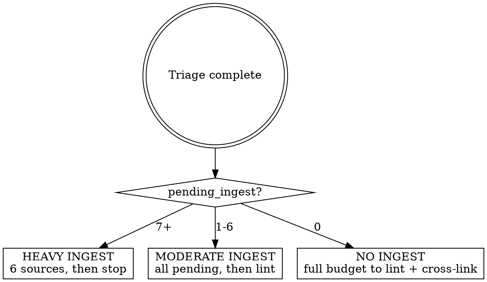

# Daily Update — Autonomous Wiki Maintenance

Safe daily routine. Triages the wiki, then spends its budget on whatever matters
most today. Defers all judgment calls. No DM input needed, no canon invented.

**Idempotent:** safe to re-run if interrupted. Wiki-init resumes interrupted work via
`work-queue.md`; ingest dedup prevents double-processing; lint `--fix` is idempotent.

**Error policy:** if any step errors, log the error, commit whatever is clean, and
continue to the next phase. Never abort the entire routine for a single-phase failure.

---

## Step 1 — Wiki-Init Fast Check

Load and run `ttrpg-llm-wiki-init`. It validates structure, auto-corrects deviations,
and resumes any interrupted work-queue tasks. If it finds structural issues, it commits
them with `fix:` prefixes before returning control.

---

## Step 2 — Triage

Run these three commands to assess the wiki's state before deciding what to work on:

```bash
python3 .claude/scripts/check_ingest.py --count
sea lint --summary
bash .claude/skills/cross-linker/scripts/check-tools.sh
```

Record three numbers:
- **pending_ingest** — count from `check_ingest.py`
- **lint_autofixable** — count of issues `--fix` would resolve (frontmatter/formatting)
- **obsidian_available** — whether `check-tools.sh` succeeded (cross-linking possible)

---

## Step 3 — Execute by Priority

Spend context on the highest-value work first. The priority chain is:

```
INGEST → LINT → CROSS-LINK
```

Each source ingested consumes significant context (reading source, loading domain
skills, writing pages). Each lint fix is cheap. Cross-linking is moderate. Use the
triage numbers to decide depth at each tier — the goal is maximum wiki improvement
per run without degrading quality by exhausting context.



### Tier 1 — Ingest

Load `ttrpg-wiki-ingest` and follow its full protocol — dedup gate, skill chain
(writing standards, domain skills), per-source archive. Process sources in the
order `check_ingest.py` returns them (do not cherry-pick or reorder).

| Pending | Sources to process | Then |
|---|---|---|
| 7+ | 6 (use `--limit 6`) | Stop — skip lint and cross-link. Ingest is the bottleneck; new pages will need linking tomorrow anyway. |
| 1–6 | All | Continue to lint with remaining budget. |
| 0 | — | Skip to lint. |

If a single source errors during ingest, skip it, log the failed path, and continue
with the next. Commit per the ingest skill's cadence.

### Tier 2 — Lint

Always run the mechanical auto-fix pass:

```bash
sea lint --fix
git add wiki/ && git diff --cached --quiet || git commit -m "curation: daily lint --fix"
```

Then assess what remains:

```bash
sea lint --summary
```

**If this tier has the remaining budget** (ingest was 0 or light): run `--report`
to write `wiki/dm/review-queue.md`, then commit it. This surfaces judgment items
for the DM without acting on them.

```bash
sea lint --report
git add wiki/dm/review-queue.md && git diff --cached --quiet || git commit -m "curation: update review queue"
```

**Do not manually fix any reported issues.** Broken wikilinks, orphans, tag variants,
naming conventions — all deferred.

### Tier 3 — Cross-Link

Only runs when:
1. Obsidian is running (from triage), AND
2. Ingest was light (0–6 sources) — heavy ingest skips this tier.

Load the `cross-linker` skill. The cross-linker references `content/` paths — this
vault uses `wiki/` as the content root; translate accordingly.

| Budget remaining | Depth |
|---|---|
| Full (no ingest today) | Up to 15 orphans (`-limit 15 -suggest`) |
| Moderate (light ingest) | Up to 5 orphans (`-limit 5`) |

Commit: `curation: daily cross-link — N links added`

If Obsidian is not running, log "cross-linking skipped — Obsidian not running" and
continue.

---

## Step 4 — Finalize

```bash
python3 .claude/scripts/regen_index.py --write
git add wiki/index.md && git diff --cached --quiet || git commit -m "curation: regenerate index"
```

---

## Step 5 — Report

Output a brief summary. For scheduled/cron runs, also append to
`wiki/dm/daily-log.md` (create if missing).

```
Daily update complete.
- Budget: [heavy ingest / moderate ingest + lint / lint + cross-link / etc.]
- Init: [ok / N fixes]
- Ingest: [N sources processed / queue clear / N remaining]
- Lint: [N auto-fixes / N issues deferred to review queue]
- Cross-link: [N links added / skipped]
- Index: regenerated
- Errors: [none / list of failed steps]
```

---

## Safety Boundaries

Non-negotiable for autonomous runs:

- **Never invent canon.** Content is only created during ingest via the extraction protocol.
- **Never make judgment calls.** Surface them in the review queue, don't act on them.
- **Never exceed 6 ingest sources per run.** Quality per source matters more than throughput.
- **Always commit.** Every phase that changes files gets its own commit.
- **Never skip wiki-init or triage.** Init catches drift; triage prevents wasted context.

---

## What This Skill Does NOT Do

- Full audit (use `ttrpg-llm-wiki-init` Full Audit Mode)
- Manual curation (broken links, orphans, tag cleanup — request explicitly)
- Faction clock advancement (use `world-update`)
- Session prep (use `prep-session`)
- Content writing or rewriting (use `ttrpg-writing`)
