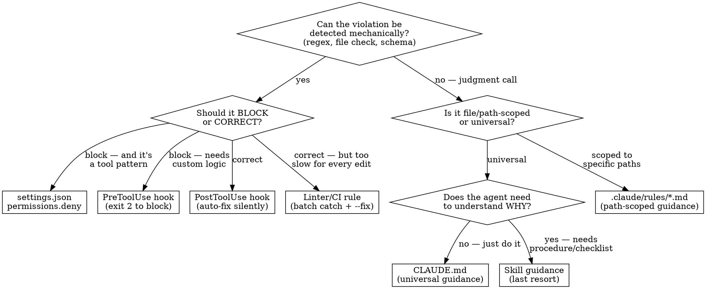

# Enforced in Code

## Overview

Fix recurring problems once, permanently, at the lowest-context layer that can catch them. Every token spent reminding an agent of a rule is wasted if a script can enforce it silently. Every hook that fires is wasted if a permission can block the action outright.

**Core principle:** Push enforcement down the stack. The best fix is one the agent never sees.

## Decision Flowchart



## Enforcement Stack (strongest to weakest)

| Layer | Mechanism | Token cost | Agent sees it? | When to use |
|---|---|---|---|---|
| 1 | `permissions.deny` | 0 | No | Block a tool pattern outright (e.g., `Bash(rm -rf *)`) |
| 2 | PreToolUse hook | ~0 (runs silently) | Only on block | Custom blocking logic (e.g., reject .env edits) |
| 3 | PostToolUse hook | ~0 (runs silently) | Only on warning | Auto-fix after every write (e.g., frontmatter, formatting) |
| 4 | Linter / CI check | 0 until run | On explicit run | Batch detection, cross-file checks, things too slow for hooks |
| 5 | `.claude/rules/*.md` | ~0 until path match | Yes, on file access | Path-scoped guidance (loads only for matching files) |
| 6 | `CLAUDE.md` | Always loaded | Yes, every turn | Universal behavioral guidance |
| 7 | Memory | First 200 lines | Yes, at session start | Cross-session facts the agent should know |
| 8 | Skill | On-demand | Yes, when invoked | Procedures, checklists, complex workflows |

**Always start at layer 1 and work down.** Only reach for guidance (layers 5-8) when the problem requires judgment.

## Implementation Patterns

### Adding a permission deny

In `.claude/settings.json` under `permissions.deny`:
```json
"deny": ["Bash(rm -rf *)", "Bash(git push --force *)"]
```

### Adding a PreToolUse hook (blocking)

Create `.claude/hooks/<name>.sh`. Core pattern:
```bash
#!/usr/bin/env bash
set -euo pipefail
FILE=$(python3 -c "
import os, json
raw = os.environ.get('CLAUDE_TOOL_INPUT', '{}') or '{}'
try: print(json.loads(raw).get('file_path', ''))
except: print('')
" 2>/dev/null || true)

# Guard: only check relevant files — adapt the pattern to your project
[[ "$FILE" == *.md ]] || exit 0

# Check condition — exit 2 to block, 0 to allow
if some_check_fails "$FILE"; then
  echo "BLOCKED: reason"
  exit 2
fi
exit 0
```

Register in `.claude/settings.json`:
```json
"PreToolUse": [{"matcher": "Write|Edit", "hooks": [{"type": "command", "command": "bash .claude/hooks/<name>.sh"}]}]
```

### Adding a PostToolUse hook (corrective)

Same shell pattern, but always `exit 0`. Fix the file in-place or emit a warning to stderr. The agent sees stderr output as tool feedback.

### Adding a linter / CI rule

Add a check to your project's existing linter (ESLint, Ruff, custom lint script, etc.) or CI pipeline. Prefer `--fix` mode for auto-correctable violations. This is the right layer for checks that are too expensive to run on every file save but should catch issues before commit or merge.

### Adding a path-scoped rule

Create `.claude/rules/<name>.md`:
```markdown
---
paths: ["src/components/**"]
---
Component files must export a named function, not an arrow function assigned to a const.
```

Rules without `paths:` load at session start (same cost as CLAUDE.md). Rules with `paths:` load only when the agent reads a matching file — zero cost otherwise.

## Worked Examples

**Problem:** "Agent keeps leaving `console.log` statements in committed code."

1. Mechanical? **Yes** — regex can detect `console.log(` in `.ts`/`.js` files.
2. Block or correct? **Correct** — remove them automatically.
3. Hook or lint? **Linter** — already part of ESLint (`no-console` rule). Enable it with `--fix`.
4. **Solution:** Enable the existing lint rule in your ESLint config. Zero new infrastructure.

**Problem:** "Agent writes migration files but forgets to add a rollback."

1. Mechanical? **Partially** — can check that a migration file contains both `up` and `down` exports via regex. But whether the rollback is *correct* is a judgment call.
2. **Solution:** Two layers:
   - **Layer 3:** PostToolUse hook that checks newly written `migrations/**` files for a `down` export and warns if absent.
   - **Layer 5:** `.claude/rules/migrations.md` scoped to `migrations/**` explaining what a valid rollback looks like.

## When Automation Isn't Possible

Some problems can't be fully automated — they require judgment, context, or LLM-level understanding. When you hit the bottom of the mechanical stack, **maximize the automated portion** before falling through to guidance:

1. **Split the problem.** Separate mechanical symptoms from judgment calls. Automate the mechanical part (hook/lint), guide the rest (rule/CLAUDE.md).
2. **Pick the cheapest guidance layer.** Path-scoped rules (Layer 5) cost nothing outside their scope. CLAUDE.md (Layer 6) costs every turn. Skills (Layer 8) cost only when invoked. Don't load guidance universally if it only applies to one file type.
3. **Make the guidance actionable.** A rule that says "write better prose" is noise. A rule with a bad/good example pair and a concrete checklist changes behavior.

If a problem truly can't be addressed in code at all — say, a creative direction preference with no mechanical signal — document it at the cheapest layer that reaches the agent when it matters.

## When NOT to Automate

- **One-off problems** — if it happened once, fix it once. Don't build infrastructure.
- **Rapidly evolving standards** — if the rule is still being figured out, use CLAUDE.md or a skill until it stabilizes, then push it down the stack.
- **Cross-file semantic checks** — if the check requires understanding relationships across many files, it belongs in a linter/CI rule (batch), not a hook (per-file).

## Red Flags

If you catch yourself doing any of these, stop and push the fix down the stack:

| You're about to... | Instead... |
|---|---|
| Add a reminder to a skill | Add a hook or lint rule |
| Write "remember to X" in CLAUDE.md | Check if a PostToolUse hook can do X automatically |
| Manually fix the same formatting issue twice | Add it to a PostToolUse hook or formatter config |
| Tell the agent to "always check Y" | Make a hook that checks Y |
| Add a rule that could be a regex | Add it to your linter with `--fix` |
