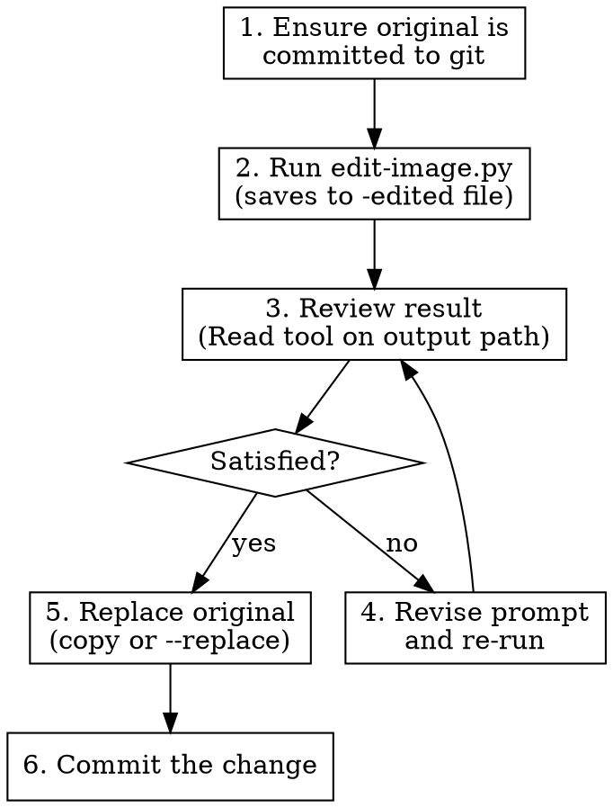

# OpenRouter Image Editing

Edit existing images by sending them to a vision-capable model with an editing instruction. Bundled Python script — pure stdlib, no dependencies.

## Setup

Same as openrouter-image-gen. Add to `~/.env` or your project's `.env`:

```
OPENROUTER_API_KEY=sk-or-v1-your-key-here
```

Default model: `google/gemini-2.5-flash-image` (Nano Banana). Override via `--model` or `OPENROUTER_IMAGE_MODEL`.

## How to Edit an Image

```bash
python3 .claude/skills/openrouter-image-edit/edit-image.py INPUT_IMAGE "edit instruction"
```

The script saves the edited image alongside the original (as `{stem}-edited.{ext}`) and prints the output path to stdout. The original is never overwritten unless `--replace` is passed.

### Options

| Flag | Purpose | Default |
|------|---------|---------|
| `--output`, `-o` | Output file path | `{input_stem}-edited.{ext}` |
| `--model`, `-m` | Model ID override | `$OPENROUTER_IMAGE_MODEL` or `google/gemini-2.5-flash-image` |
| `--aspect`, `-a` | Aspect ratio (1:1, 16:9, 4:3, etc.) | Model default |
| `--image-size`, `-s` | Resolution: 0.5K, 1K, 2K, 4K | Model default |
| `--replace`, `-r` | Overwrite input file with result | Off |

### Examples

```bash
# Basic edit — result saved as portrait-edited.png
python3 .claude/skills/openrouter-image-edit/edit-image.py wiki/assets/portraits/npc.png \
  "add a scar running across the left cheek"

# Explicit output path
python3 .claude/skills/openrouter-image-edit/edit-image.py scene.jpg \
  "change the sky to a dramatic sunset with storm clouds" \
  --output scene-sunset.jpg

# Higher resolution
python3 .claude/skills/openrouter-image-edit/edit-image.py map.png \
  "add a compass rose in the bottom-right corner" \
  --image-size 2K
```

## Workflow: Edit-Review-Replace

Follow this cycle. Do not skip the review step.



### Step by step

1. **Ensure the original is committed.** Before any edit, verify the source image is tracked by git. If it has uncommitted changes, commit them first. This makes the pre-edit version recoverable via `git checkout HEAD -- path/to/image.png`.

2. **Run the edit script.** Pass the image and your editing instruction. The result saves to `{stem}-edited.{ext}` by default — the original stays untouched.

3. **Review the result.** Use the Read tool on the output path to visually inspect it. Send it to the user with SendUserFile if they need to approve.

4. **Revise if needed.** If the edit missed the mark, adjust the prompt and re-run. Common adjustments:
   - Be more specific about the region ("the character's left hand, not the right")
   - Add style anchoring ("maintain the existing oil painting style")
   - Simplify — ask for one change at a time

5. **Replace the original.** Once the edit is approved, either:
   - Re-run with `--replace` to overwrite in place, or
   - Copy the edited file over the original with Bash (`cp edited.png original.png`)

6. **Commit.** The old version lives in git history. Mention what changed in the commit message.

### Restoring the original

```bash
# See what the image looked like before the edit
git show HEAD~1:path/to/image.png > /tmp/original.png

# Restore it
git checkout HEAD~1 -- path/to/image.png
```

## Writing Good Edit Prompts

See **references/editing-prompts-guide.md** for detailed guidance.

Key rules:
- **Be specific about location.** "Add a scar on the left cheek" not "add a scar"
- **One edit per pass.** Complex multi-part edits lose coherence — chain simple edits
- **Anchor the style.** "Maintain the existing watercolor style" prevents style drift
- **Describe the result, not the process.** "The sky is a deep orange sunset" not "change the RGB values of the sky pixels"
- **No inpainting masks.** The model decides what to modify based on your text — be precise

## Available Models

Models that support both image input and image output:

| Model ID | Codename | Best for | Cost |
|----------|----------|----------|------|
| `google/gemini-2.5-flash-image` | Nano Banana | General edits, good cost/quality | $0.30/$2.50 per M tokens |
| `google/gemini-3.1-flash-image-preview` | Nano Banana 2 | Higher quality edits | $0.50/$3.00 per M tokens |
| `google/gemini-3-pro-image-preview` | Nano Banana Pro | Precision edits, lighting, camera | $2.00/$12.00 per M tokens |
| `openai/gpt-5-image` | — | Complex scene manipulation | $10/$10 per M tokens |
| `openai/gpt-5-image-mini` | — | Budget alternative to GPT-5 | $2.50/$2 per M tokens |

Nano Banana (default) handles most edits well. Upgrade to Nano Banana Pro for fine-grained control over lighting, focus, and localized changes.

## Troubleshooting

| Error | Fix |
|-------|-----|
| "Input image not found" | Check the path — must be absolute or relative to cwd |
| "OPENROUTER_API_KEY not set" | Add key to `~/.env` or project `.env` |
| API error 413 / timeout | Image too large — resize or compress before editing |
| Edit ignores your instruction | Be more specific; try one change at a time; see prompting guide |
| Style drifts from original | Add "maintain the existing art style" to your prompt |
| "Could not extract image" | Model may not support image output — try a different model |
