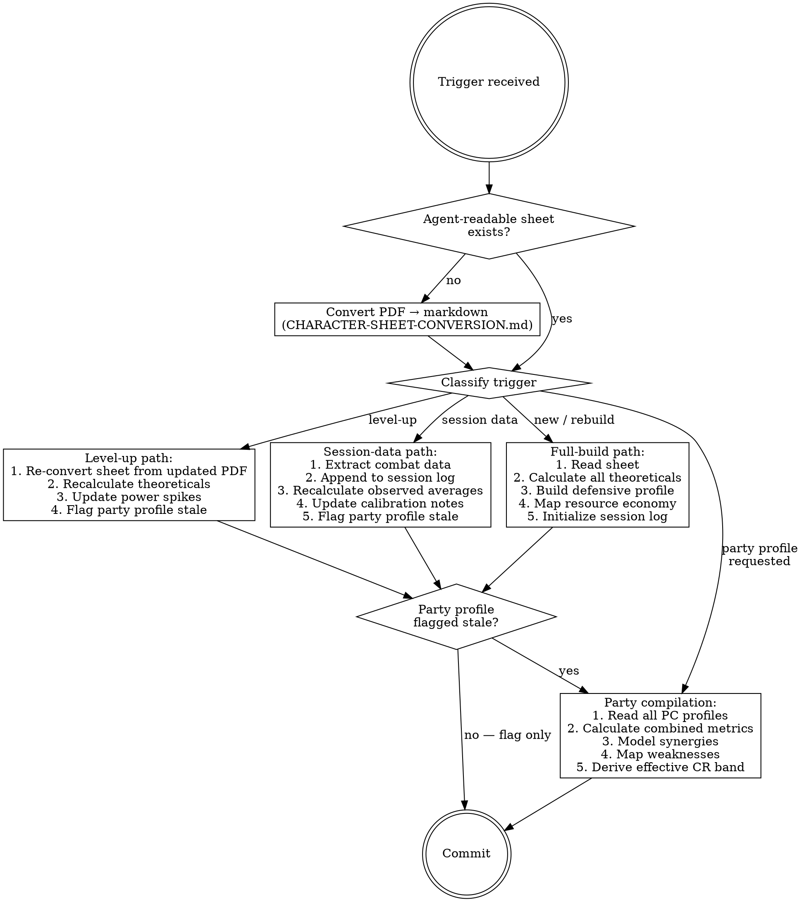

## Overview

This skill produces **agent-optimized combat intelligence** — quantitative profiles
that compound with each session. It replaces CR's generic assumptions with empirical
data from this table: real dice rolls, real damage, real tactics.

**Two output tiers:**
1. **PC Combat Profiles** — per-character documents with theoretical maximums,
   observed performance, defensive thresholds, and a running session log.
2. **Party Combat Profile** — compiled from individual profiles into a single
   encounter-calibration reference.

The party combat profile is what `prep-encounter` reads. The PC profiles feed it.

---

## Prerequisites

Before any primer work, read:
1. The PC's character sheet: `wiki/system/players/{pc-slug}-sheet.md`
   - **If this file doesn't exist:** check for a PDF in `.raw/characters/` or
     `wiki/entities/characters/pcs/`. If a PDF exists, convert it first using
     `references/CHARACTER-SHEET-CONVERSION.md`. The markdown sheet is the canonical
     mechanical source for all downstream calculations.
   - **If no PDF exists either:** ask the user to provide the character sheet.
2. Existing primer (if updating): `wiki/system/{pc}-primer.md` or `wiki/dm/{pc}-primer.md`
3. `wiki/dm/combat-analytics.md` — current empirical observations
4. `wiki/system/party-combat-primer.md` — current party-level intelligence

If updating after a session, also read the session's combat scenes
(e.g., `wiki/sessions/session-{NN}-scene-*-encounter.md` or relevant scenes with
combat tag).

---

## Character Sheet Conversion

When a character sheet PDF is available but no agent-readable markdown exists at
`wiki/system/players/{pc-slug}-sheet.md`:

1. Read the PDF using the Read tool (supports PDF natively)
2. Convert to structured markdown following `references/CHARACTER-SHEET-CONVERSION.md`
3. Write to `wiki/system/players/{pc-slug}-sheet.md`
4. Keep the original PDF in place — it remains the player's reference copy
5. Proceed with combat profile work using the new markdown as source

**Update cadence:** When a player provides an updated PDF (level-up, new gear),
re-convert and bump the `last_synced` date. Flag downstream combat profiles as stale.

---

## Interview

If the user's request doesn't already specify:
- **Which PC(s)?** (or "all" / "party profile")
- **What triggered this?** (level-up, new session data, new gear, full rebuild)
- **Session number** if updating from session data (to locate transcript/scenes)

For a full rebuild (new campaign start or first-time profile), also confirm:
- Access to character sheet or ask user to provide key stats

---

## Workflow



---

## PC Combat Profile — Output Structure

Filed to: `wiki/dm/{pc-slug}-combat-profile.md`

Read `references/PC-COMBAT-PROFILE.md` for full field definitions and quality bar.

### Sections (in order)

1. **Fast Read** — 4-line summary: role, sustained DPR, nova DPR, effective HP
2. **Offensive Profile** — theoretical calculations at current level/gear
3. **Defensive Profile** — AC, saves, HP, escape abilities, condition resistances
4. **Resource Economy** — per-short-rest and per-long-rest budget table
5. **Counter Profile** — what shuts this PC down and what they can't handle
6. **Synergy Hooks** — how this PC amplifies or depends on party members
7. **Session Combat Log** — append-only table of empirical data per session
8. **Calibration Notes** — derived conclusions from observed vs. theoretical

### Frontmatter

```yaml
type: dm-intelligence
subtype: pc-combat-profile
campaign: shattered-sea
status: active
audience: agent
publish: false
pc: "{pc-slug}"
pc_level: {current level}
last_session_data: {session number}
theoretical_dpr_sustained: {number}
theoretical_dpr_nova: {number}
effective_hp: {number}
primary_save_weakness: "{save type}"
update_trigger: "level-up, new session combat data, significant gear change"
```

---

## Party Combat Profile — Output Structure

Filed to: `wiki/dm/party-combat-profile.md`

Read `references/PARTY-COMBAT-PROFILE.md` for full field definitions.

### Sections (in order)

1. **Fast Read** — party level, size, combined sustained DPR, combined nova DPR,
   total effective HP, healing per short rest
2. **Combined Offensive** — party burst damage (round 1 all-in), sustained DPR,
   focus-fire potential, AoE capability
3. **Combined Defensive** — lowest/highest AC, save distribution, total HP pool,
   healing economy, concentration count
4. **Synergy Matrix** — which PC combos multiply output (with observed evidence)
5. **Weakness Map** — what the party structurally cannot handle
6. **Effective CR Band** — empirically derived difficulty mapping
7. **Encounter Design Parameters** — compiled prep levers from all PC profiles
8. **Update History** — when and why the profile was last recalculated

### Frontmatter

```yaml
type: dm-intelligence
subtype: party-combat-profile
campaign: shattered-sea
status: active
audience: agent
publish: false
party_level: {level}
party_size: {count}
combined_sustained_dpr: {number}
combined_nova_dpr: {number}
total_effective_hp: {number}
healing_per_short_rest: {number}
effective_cr_easy: "{CR range}"
effective_cr_medium: "{CR range}"
effective_cr_hard: "{CR range}"
effective_cr_deadly: "{CR range}"
last_compiled: "{date}"
mandatory_for: [encounter-design]
token_profile: always-read
update_trigger: "any PC profile updated"
```

---

## Data Extraction

When processing session combat data, read `references/DATA-EXTRACTION.md` for the
extraction protocol. Key principle: **record what happened, not what should have
happened.** Theoretical calculations come from the sheet; the session log records
empirical reality.

---

## Effective CR Band Derivation

The party combat profile's most important output. This replaces generic CR tables
with table-specific calibration:

1. Start with standard 5e XP thresholds for party level and size.
2. Adjust based on observed patterns:
   - If party consistently trivializes encounters at a given CR → raise the floor
   - If party nearly TPKs at a given CR → lower the ceiling
   - Weight recent sessions more heavily than early ones
3. Factor in specific strengths/weaknesses:
   - Party has no AoE → clustered enemies are harder than CR suggests
   - Party has exceptional single-target → solo monsters are easier than CR suggests
   - Party coordination bonus → multi-target encounters are relatively easier
4. Express as CR ranges per difficulty tier, with confidence notes.

Mark any band derived from fewer than 3 encounters at that tier as `[low confidence]`.

---

## Relationship to Existing Primers

The **existing PC primers** (`wiki/system/{pc}-primer.md` and `wiki/dm/{pc}-primer.md`)
remain as-is. They serve a different purpose: qualitative encounter design guidance
(spotlight/pressure/avoid). They are the "what to do" files.

The **combat profiles** this skill produces are the "how much" files — quantitative
data that feeds difficulty calibration. The existing party-combat-primer and
combat-analytics files will be superseded by the party combat profile once it's
mature enough (3+ sessions of data).

**Transition plan:**
- Phase 1: Create combat profiles alongside existing primers (additive)
- Phase 2: Party combat profile absorbs `combat-analytics.md` content
- Phase 3: `party-combat-primer.md` references party combat profile for numbers

---

## Cross-Skill Coordination

- **`session-ingest`** — After combat data is ingested from a session, this skill
  should be invoked to update affected PC profiles. Flag in session-ingest output.
- **`prep-encounter`** — Reads the party combat profile for difficulty calibration.
  The party combat profile is mandatory pre-read for encounter design.
- **`prep-creature`** — When designing a creature to challenge a specific PC, read
  that PC's combat profile for counter-profile and defensive thresholds.
- **`prep-session`** — Reference party combat profile when
  calibrating session encounter density and rest pacing.

---

## Filing

| Output | Path | Commit prefix |
|---|---|---|
| Character sheet (converted) | `wiki/system/players/{pc-slug}-sheet.md` | `prep:` |
| Character sheet (re-synced) | same | `curation:` |
| PC combat profile (new) | `wiki/dm/{pc-slug}-combat-profile.md` | `prep:` |
| PC combat profile (update) | same | `curation:` |
| Party combat profile (new) | `wiki/dm/party-combat-profile.md` | `prep:` |
| Party combat profile (update) | same | `curation:` |

After writing:
1. Add entry to `wiki/index.md` under `## dm-intelligence` (or create section)
2. Add reciprocal links from the PC's main entity page
3. Commit with message: `prep: combat-profile — {pc-slug} — {trigger summary}`

---

## Quality Gates

- Every number must cite its source: `[sheet]`, `[session-NN]`, `[calculated]`
- Theoretical calculations must show the math inline (one line per step)
- Observed data without at least 2 data points gets `[insufficient data]` flag
- Never mix theoretical and observed in the same field — keep separate columns
- Session log entries are append-only; never delete historical data
- Confidence levels: `high` (5+ sessions), `medium` (3-4), `low` (1-2), `theoretical` (0)

---

## Reference Files

| File | Read when |
|---|---|
| `references/PC-COMBAT-PROFILE.md` | Creating or updating any PC combat profile |
| `references/PARTY-COMBAT-PROFILE.md` | Compiling or updating the party combat profile |
| `references/DATA-EXTRACTION.md` | Processing session combat data into profile updates |
| `references/CHARACTER-SHEET-CONVERSION.md` | Converting a PDF character sheet to agent-readable markdown |
| `../prep-encounter/references/ENCOUNTER.md` | Understanding how encounter design consumes this data |
| `../prep-encounter/references/CR-TABLES.md` | Baseline CR math for effective CR band derivation |
