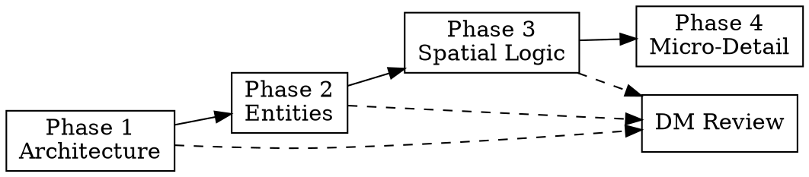

> **Shared prep conventions** — stub check, interview + PC-connection requirement, combat calibration, prose pass, and filing — live in your project's `prep-family-standards.md` reference if one exists. Read it before generating; this file covers only what's specific to this content type.

Read these before generating any dungeon content:
1. `<wiki>/hot.md` — current campaign state, active faction clocks
2. `<wiki>/system/party-combat-primer.md` — party combat patterns, Avoid flags (binding)

---

## Interview

If user message doesn't answer these, ask all at once:
- What is this site? (temple, smuggler hideout, sunken ruin, monster lair, etc.)
- Who built it, and who occupies it now?
- What drew the party here — which PC thread connects, and how?
- Approximate room count (default: 6–10)
- Is there a hidden conclusion the party must reach? (triggers Three Clue Rule)

Name the connecting PC or ask before generating.

---

## Toy Fields (Frontmatter + Body)

| Field | Content |
|---|---|
| `verb` | What this site *does* — its active principle. One of: Defend, Attract, Consume, Conceal. |
| `unstable_condition` | Concrete state that is about to break. ✓ "The smugglers' dead drop schedule has slipped — two pickups overdue." ✗ "The place feels dangerous." |
| `consequence` | What happens if no one intervenes. ✓ "The overdue runner sends a cleanup crew that torches the cache." ✗ "Things escalate." |
| `link_of_relevance` | Which PC's thread connects here. Required. |

---

## The Four-Phase Pipeline

Never generate a dungeon in a single pass. Each phase constrains the next — skipping
phases produces shallow, contradictory output. Write each phase to disk before starting
the next. Present each phase's output to the DM for review before advancing.



### Phase 1 — Architecture

Generate the skeleton. No room descriptions, no NPC prose, no flavor.

**Outputs:**
- Overarching conflict (one sentence — what is building toward a breaking point?)
- The dungeon's original purpose vs. current use (one sentence each)
- Major factions present (1–3) with a single proactive goal each
- Room list with names and connections only — no descriptions yet
- If-ignored: what happens if the party never enters this site

**Three Clue pass:** If a hidden conclusion exists, identify three distinct, mechanically
discoverable clues now — before detailing rooms. Assign each to a different room. Two
clues in the same room is a structural failure.

**Constraint:** No NPC names, no room descriptions, no secrets. Structure only.

Get DM confirmation before Phase 2.

### Phase 2 — Entities

Populate the site with NPCs and creatures. Route NPC creation through `prep-npc` standards.
Route encounter design through `prep-encounter` standards.

For each NPC:
- Roleplay Concept (mashup format)
- Quote (one speakable line)
- Proactive objective (what they are doing when the party arrives — not waiting)
- Which room they occupy and why

For each creature encounter:
- Stat block reference (look up, never invent; for homebrew creatures, load `prep-creature`)
- Tactical behavior (how they open, escalate, retreat)
- Morale threshold (when they break — specific HP or condition)

**Constraint:** Every NPC must have a proactive objective that advances without the party.
Reactive NPCs who wait for players are a prep failure.

Get DM confirmation before Phase 3.

### Phase 3 — Spatial Logic

Generate the map key: room connections, terrain features, tactical structure.

Apply Bryce Lynch interactivity standards:
- Multiple routes between significant rooms (minimum two paths through the site)
- At least one secret or non-obvious connection
- Varied elevation or terrain (flooded, collapsed, elevated, narrow)
- Every space presents a meaningful choice (loud/fast vs. quiet/dangerous, fight vs. negotiate)

**Map Key format:**
```
Room 1 → Room 2 (west door), Room 4 (hidden passage behind altar)
Room 2 → Room 1, Room 3 (archway), Room 5 (trapdoor, DC 14 to find)
Room 3 → Room 2, Room 4 (stone door), Room 5 (crawl passage)
```

**Chokepoint test:** If the map has a single room that ALL paths must pass through
(other than the entrance), redesign. The bottleneck kills non-linearity.

**Tactical features per room** (minimum 2 of these):
- Cover (half or three-quarters — specify which)
- Elevation change (high ground, pit, ledge)
- Difficult terrain (water, rubble, ice, vegetation)
- Environmental hazard (darkness, noise propagation, unstable ceiling)
- Interactable object (lever, gate, flammable material)

Get DM confirmation before Phase 4.

### Phase 4 — Micro-Detail

Key each room using the OSE point-first format from `references/dm-reference-standards.md`.

**Room format:**
```
## Room N — Name

**Dimensions:** X × Y ft. Ceiling Z ft. [Terrain notes.]

> [!read-aloud]
> [3–4 sentences max. Player-facing prose mode. Slow zoom: atmosphere → detail → hook.
> Three senses minimum. End on something unresolved. No em dashes.]

**Features:**
- **Noun**: State. (Mechanic or DC)
- **NPC Name**: Role, current behavior. (Hidden agenda)
- *Item*: Description. (Effect or trigger)

> [!dm]
> [Authorial intent — what this room teaches, rewards, or tests. One sentence.]
```

**Typographic encoding (mandatory):**
- **Bold** = monsters, NPCs, immediate physical threats
- *Italic* = magical items, spells, named treasure
- Plain text = environment, non-threatening objects

**Objective third person only.** Always "the characters" or "the party", never "you" in
DM-facing sections. Second person is reserved for `> [!read-aloud]` callouts only.

**Anti-Slop pass — run on every room before finalizing:**
- Deletion Test: remove every adjective that isn't a mechanical signal
- Negation Limit: max two negative constructions per room — rewrite the rest as affirmatives
- Banned Structures: delete all contrastive reframes, "kind of" constructions, rhetorical questions, trite escalation
- Rule of Threes: each room gets primary intent + max three supporting sub-points
- Two-Paragraph Rule: after any atmospheric sentence, the next must be plain and mechanical

---

## Three Clue Audit

When a hidden conclusion exists, include this block in the output:

```
## Three Clue Audit
Conclusion: [One sentence — what players must understand]
Clue 1: [Room N] — [How discovered — specific mechanic]
Clue 2: [Different room] — [Different mechanic]
Clue 3: [Third room or NPC] — [Third mechanic]
Note: at least two clues reachable without combat.
```

If you cannot name three distinct clues at three different rooms, the dungeon is
incomplete. Add access points before finalizing.

---

## Output Sections (Final Page)

1. Frontmatter (see below)
2. `> [!read-aloud]` — first-impression entrance description
3. `## Overview` — 2–3 sentences: what this site is, who is here, why it matters now (DM voice)
4. `## Access` — how to get in, alternative entrances
5. `## General Features` — light, ceilings, walls, sound, smell (applies to entire site)
6. `## Map Key` — structured room connection list (from Phase 3)
7. `## Room 1 — [Name]` through `## Room N` — keyed rooms (from Phase 4)
8. `## Three Clue Audit` — if applicable
9. `## Clues & Threads` — summary table: clue, location, what it connects to
10. `## Treasure Summary` — table: item, value, location. For any homebrew items in the
    treasure, route through `prep-hb-item` (with DM review gate) before placing in this
    table — do not invent homebrew mechanics inline.
11. `## Running This Dungeon` — pacing notes, if-loud / if-stealthy / if-negotiate variants
12. `## If Ignored` — what happens to this site when the party doesn't come (from Phase 1)
13. `## Connections` — wikilinks to related entities, factions, situations

---

## Frontmatter

Universal and entity fields are auto-completed by the write hook. You must author:

- `subtype: dungeon`
- `verb`, `unstable_condition`, `consequence`, `link_of_relevance` (see Toy Fields)
- `rooms:` — integer room count
- `cr_range:` — e.g. `"1/2–3"` — CR range of encounters in this site
- `topology:` — `linear | branching | hub | loop` — dominant connection pattern

---

## Filing

Path: `<wiki>/entities/places/dungeons/slug.md`

After writing:
1. Add entry to `<wiki>/index.md` under the appropriate section
2. Verify all wikilinks resolve (`rg --files <wiki> | rg -i "slug"`)
3. Add reciprocal links to all referenced entities
4. If the dungeon has a faction clock: add or update entry in `<wiki>/hot.md`
5. Commit: `feat: dungeon — {slug} — {one-line summary}`

---

## Wikilink Verification

Before writing any wikilink, verify the target exists:
```bash
rg --files <wiki> | rg -i "name-fragment"
```
If the target doesn't exist, either create a stub or use plain text. Dead wikilinks
silently break the vault.

---

## Encounter Calibration

Do not invent stat values, DCs, or damage dice. For any mechanical value:
1. Look up the stat block in the rules reference
2. Cross-reference with `<wiki>/system/party-combat-primer.md` for party-specific adjustments
3. Check party Avoid flags — if your encounter would violate one, redesign

Route complex encounters to `prep-encounter` for full calibration.

---

Load `ttrpg-writing` for all prose and formatting standards — mode selector, Brennan
voice, anti-slop pass, and callout types apply to every dungeon page.

---

## Reference Files

| File | Read when |
|---|---|
| `references/DUNGEON.md` | Full dungeon template, room key examples, topology patterns |
| `../prep-location/references/LOCATION.md` | Location template foundations (dungeons are a location subtype) |
| `../prep-encounter/references/CR-TABLES.md` | CR scaling and party balance when calibrating encounters |
| `../sandbox-narrative/references/SANDBOX-PIPELINE.md` | Multi-pass pipeline reference (this skill's pipeline is derived from it) |
| `../ttrpg-writing/references/dm-reference-standards.md` | OSE formatting, Bryce Lynch, Skerples, Alexandrian standards |
| `../ttrpg-writing/references/player-facing-prose.md` | Read-aloud prose mode |
| Your project's auto-correct reference (if it exists) | Fixing structural issues during or after content creation |
| Your project's wikilink-standards reference (if it exists) | Creating or fixing wikilinks |
