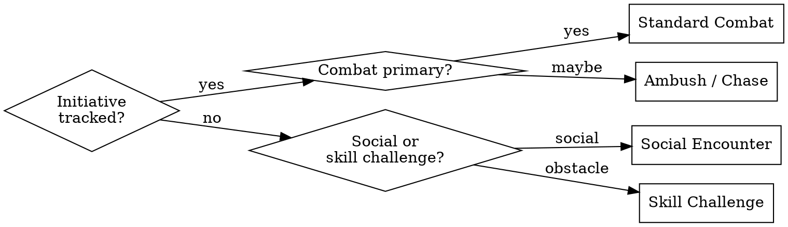

> **Shared prep conventions** — stub check, interview + PC-connection requirement, combat calibration, prose pass, and filing — live in [`prep-family-standards`](../ttrpg-llm-wiki-init/references/prep-family-standards.md). Read it before generating; this file covers only what's specific to this content type.

Read these before generating any encounter content:
1. `wiki/system/party-combat-primer.md` — party combat patterns, Avoid flags (binding)
2. `wiki/dm/combat-analytics.md` — empirical patterns observed at this table

The party primer's **Avoid** section is binding. If your encounter would violate it,
redesign before proceeding.

---

## Interview

If the user message doesn't already answer these, ask all at once:
- What type of encounter? (combat, social, skill challenge, hybrid — see Encounter Type Router)
- Which PC thread does this pull on, and how?
- Where does it take place? (existing location or new?)
- What faction or NPC drives the opposition? (existing or new?)
- Desired difficulty: deadly, hard, medium?

Name the connecting PC or ask before generating.

---

## Encounter Type Router

Classify before designing. The type shapes which output sections are primary.

| Type | Primary sections | Notes |
|---|---|---|
| **Standard combat** | Challenge Calibration + Pressure Valve + Advantage Window | Default path |
| **Social** | Drama Suite is primary; Pressure Valve = social leverage | Challenge Calibration optional |
| **Skill challenge** | Replace Challenge Calibration with Skill Track: 3–5 skills, DC tiers, failure consequences | No initiative |
| **Ambush / chase** | Terrain Shift fires round 1; Advantage Window = escape or reversal | Fast and asymmetric |
| **Hybrid** | Classify the primary mode, then add secondary mode elements | Most real encounters are hybrids |

---

## Calibration Approach

Calibrate to empirical combat patterns, not theoretical class features. Mark anything
not yet observed at table as `[unconfirmed]`.

**Enemy count:** Use `references/CR-TABLES.md` for baseline math, then adjust using
observed action economy, sustained vs. burst damage, and focus-fire behavior from
combat-analytics.

**Terrain:** Always includes 2–3 actionable terrain features. Decorative is not
actionable — each feature must have a mechanical use available to both sides.

**Faction presence:** If this encounter involves a faction from `wiki/hot.md`, match
their current resource state (depleted, reinforced, desperate).

**Multi-faction encounters:** When two or more enemy groups are present (e.g. smugglers
+ a creature), discount the total CR budget by ~25% — enemies that fight each other
reduce effective pressure on the party. Budget the full amount only if both groups
coordinate against the party.

**Scaling by tier:**

| Level | Target Tone |
|---|---|
| 1–4 | Danger is real. Terrain Shift is a lifeline. |
| 5–8 | Party has power. Target action economy and concentration. |
| 9–12 | Moving parts. Multiple objectives. Non-combat solutions viable. |
| 13–16 | Consequences beyond the room. |
| 17–20 | Threaten things they love, not their HP. |

---

## Output Structure

### The 10-Field Toy

| Field | Content | Where |
|---|---|---|
| `primary_goal` | Thematic, not tactical — what this encounter proves | Frontmatter |
| `consistent_method` | Opposition behavior and tactics | Frontmatter |
| `active_problem` | Situation already in motion before party arrives | Frontmatter |
| `performance_hooks` | One vibe reference + one tic for lead antagonist | Frontmatter |
| `link_of_relevance` | Which PC's backstory/fear/goal — required | Frontmatter |
| `terrain_shift` | One specific, timed change mid-encounter | Frontmatter |
| **Challenge Calibration** | Enemy count, stat block citations, action economy vs party | Body |
| **Pressure Valve** | Targets party weakness — tension without unfairness | Body |
| **Advantage Window** | Plays to party strength — lets them feel powerful if found | Body |
| **Drama Suite** | DC table (10/15/20), Shenanigan offers, Box of Doom flags | Body |

### Output Sections

1. `> [!dm]` — one-sentence encounter brief: who, where, why now
2. `## Enemy Roster` — names, stat block refs, role (controller / bruiser / skirmisher / artillery / lurker); for homebrew creatures, load `prep-creature` first
3. `## Terrain` — 2–3 features with mechanical effects
4. `## Tactical Notes` — how enemies open, escalate, morale/retreat threshold
5. `## Pressure Valve` — what targets party weakness
6. `## Advantage Window` — what plays to party strength
7. `## Drama Suite` — DC table, shenanigan offers, Box of Doom flags
8. `## Stakes` — what changes in the world based on outcome (specific, not generic)
9. `## If Ignored` — what happens if the party avoids or bypasses this encounter

Read `references/ENCOUNTER.md` before finalizing for field rules and quality bar.

---

## Sandbox Check

Before finalizing, verify against CLAUDE.md sandbox rules:
- **PC Boundary:** Write what enemies and environment do. Never write PC decisions or feelings.
- **NPC Agency:** Opposition has goals that predate the party. They don't wait to be discovered.
- **Pressures, Not Plots:** The encounter is a situation the party walks into. No "if players do X then Y" chains more than one step deep.
- **PC-Connection Requirement:** At least one PC's internal tensions must connect. If you can't name it, the encounter isn't ready.

Load `sandbox-narrative` for an anti-railroading pass on encounters tied to larger arcs.

---

## Cross-Skill Coordination

- **`prep-creature`** — Use published creatures when one fits the narrative need. Homebrew only when no published creature matches the encounter's thematic requirements. Load `prep-creature` first for any homebrew creature; deliver the statblock and behavioral profile before calibrating.
- **`prep-npc`** — If the encounter features a named antagonist who may recur, route through `prep-npc` for a full NPC page. Don't create throwaway NPC pages for nameless enemies.
- **`prep-location`** — If the encounter location doesn't have a wiki page and is significant enough to revisit, create one via `prep-location` (or `prep-dungeon` for multi-room sites).
- **`prep-dungeon`** — If called from prep-dungeon Phase 2, deliver the enemy roster, tactical behavior, and calibration data, then return to that skill.
- **`prep-session`** — Encounters designed for a specific session should be inlined in the run guide per that skill's inline-first conventions. File a standalone page only when the encounter is reusable or complex enough to warrant its own entry.
- **`prep-hb-item`** — If the encounter involves notable loot (named items, faction cargo, quest objects), route through `prep-hb-item` for any homebrew items with DM review. Don't invent homebrew item mechanics inline.
- **`world-update`** — If the encounter outcome would advance or set back a faction clock in `wiki/hot.md`, note which clock and by how many segments. Do not write the clock update — flag it for DM review.

---

## Visual Aid

Load `ttrpg-visual-aids` to generate combat art for the encounter. Category:
**Combat art** (16:9 widescreen). Emphasize spatial relationships, terrain features,
and tactical layout. Place at top, before tactical details.

---

## Frontmatter

Universal fields are auto-completed by the write hook. You must author the encounter-specific values:

- `type: situation` (encounters are a subtype of situation)
- `subtype: encounter`
- `encounter_type` — `combat | social | skill-challenge | hybrid`
- The six toy fields from the 10-Field Toy above: `primary_goal`, `consistent_method`, `active_problem`, `performance_hooks`, `link_of_relevance`, `terrain_shift`
- `difficulty` — `easy | medium | hard | deadly`
- `cr_budget` — total XP budget or CR range (e.g. `"CR 2–4, 1800 XP"`)

---

## Filing

**Standalone encounter** (reusable or complex): `wiki/situations/active/{slug}.md`

**Session-specific encounter** (one-time, tied to a session): inline in the session run guide. No separate file.

**Dungeon encounter** (part of a keyed site): inline in the dungeon page per `prep-dungeon` room format.

After writing a standalone file:
1. Add entry to `wiki/index.md` under `## situations`
2. Add reciprocal links to all referenced entities and factions
3. If the encounter has a faction clock connection: flag for `wiki/hot.md` update
4. Commit: `feat: encounter — {slug} — {one-line summary}`

---

Load `ttrpg-writing` before writing any prose. **DM-facing reference** for tactical
notes, stakes, and if-ignored. **Player-facing prose** for `[!read-aloud]` callouts.

---

## Reference Files

| File | Read when |
|---|---|
| `references/ENCOUNTER.md` | Full encounter toy template, field rules, quality bar |
| `references/CR-TABLES.md` | CR scaling tables, party balance calculations |
| `references/5E-FIELDS.md` | Environment interactions — difficult terrain, cover, lighting, weather |
| `../prep-creature/references/STAT-BLOCKS.md` | Encounter enemy stat block references |
| `../prep-creature/references/NAMED-ENEMIES.md` | Named antagonist stat citation patterns |
| `../ttrpg-writing/references/dm-reference-standards.md` | Writing tactical notes, enemy roster, stakes |
| `../ttrpg-writing/references/player-facing-prose.md` | Writing `[!read-aloud]` encounter text |
| `../ttrpg-writing/references/callout-standard.md` | Callout type enforcement and conversion |
| `../ttrpg-llm-wiki-init/references/auto-correct.md` | Fixing structural issues during or after content creation |
| `../ttrpg-llm-wiki-init/references/wikilink-standards.md` | Creating or fixing wikilinks |
