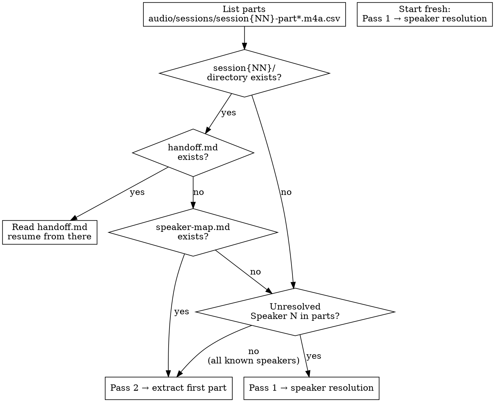
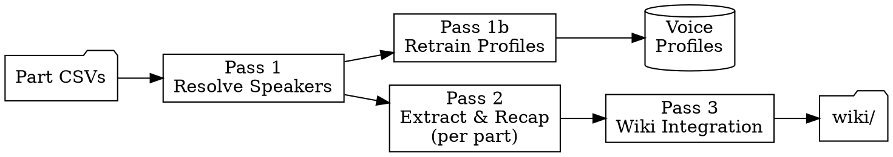

# Session Ingest

Multi-pass data mining of raw session transcription CSVs. Each part file is one
chunk — process them sequentially, one per agent turn. Checkpoints after every
part so work survives context limits and session boundaries.

Downstream consumers: `transcript-ingest.md`, `session-recap`, `world-update`,
`combat-analytics.md`, `player-interests.md`.

---

## Entry Point



Every invocation:

1. List available parts: `ls <sessions-dir>/session{NN}-part*.csv`
2. Check for working directory: `<sessions-dir>/session{NN}/`
3. If `handoff.md` exists → read it and resume where it says
4. If `speaker-map.md` exists but no handoff → start Pass 2 (extraction)
5. If neither exists → check parts for Speaker N labels → Pass 1 if needed, else straight to Pass 2

## Required Skill Chain

Run `ttrpg-llm-wiki-init` once at session start. Load `ttrpg-writing` when writing
prose for wiki pages. Sandbox rules are in CLAUDE.md (always loaded).

---

## Input

| File | Format | Location |
|---|---|---|
| Transcript parts | CSV: `ID,Speaker,Text` | `<sessions-dir>/session{NN}-part{PP}.csv` |

Each part is one audio segment (~250–1000 lines). The transcription tool applies
the custom dictionary automatically — CSVs already have corrected spellings.
Parts arrive incrementally. Process whatever is available.

**Each part file is one chunk.** Do not combine parts into a single file. Process
them in order: part00, part01, part02, etc.

## Working Directory

Each session: `<sessions-dir>/session{NN}/`

All intermediate files live here. These are checkpoints — resume from the latest.

| File | Produced By | Purpose |
|---|---|---|
| `speaker-map.md` | Pass 1 | Speaker resolution decisions with evidence |
| `recap.md` | Pass 2 (cumulative) | Condensed IC-only scene summaries |
| `extracts.md` | Pass 2 (cumulative) | Tagged canon extracts organized by scene |
| `flags.md` | Pass 2 (cumulative) | Unresolved ambiguities for DM review |
| `combat-summary.md` | Pass 2 (after final part) | Structured per-PC combat data for primer updates |
| `progress.txt` | Pass 2 (per part) | Which parts have been processed |
| `handoff.md` | Pass 2 (per part) | Self-contained prompt for the next agent |

---

## Pass Architecture



Full per-pass procedures, file formats, and the final-part wrap-up live in
`references/pass-architecture.md` — read it before running any pass.

| Pass | Goal | Input → Output | Judgment ref |
|---|---|---|---|
| **1: Resolve Speakers** | Map every `Speaker N`/`Unknown` to a known identity with evidence + confidence. Skip entirely if all labels are known. | all part CSVs → `speaker-map.md` | `references/speaker-resolution.md` |
| **1b: Retrain Profiles** | Feed speaker corrections back to voice profiles so future sessions have fewer unknowns. Runs automatically after Pass 1 if cold-pass chunks + WAVs exist in the inbox directory. | `speaker-map.md` + cold-pass chunks + WAVs → updated voice profiles | `references/pass-architecture.md` |
| **2: Extract & Recap** | One part per agent: classify IC/OOC/META, merge fragments, split scenes, extract tagged canon, then commit + handoff + **stop**. No wiki writes. | part CSV + `speaker-map.md` + current world state file → `recap.md` + `extracts.md` + `flags.md` (cumulative); `combat-summary.md` after final part | `references/extraction-targets.md` |
| **3: Wiki Integration** | Fold recap + extracts into the wiki via the existing ingest pipeline once `flags.md` is clear. | `recap.md` + `extracts.md` + `flags.md` → wiki files | load `ttrpg-wiki-ingest` (`references/transcript-ingest.md`) + `ttrpg-writing` |

Pass-2 detail (the per-part 13-step procedure, scene-continuity-across-parts
rules, recap/handoff/combat-summary formats, and the final-part checklist) and
the Pass-3 wiki-target mapping are all in `references/pass-architecture.md`.

---

## Incremental Processing

Parts arrive as audio transcribes. The part-per-chunk architecture handles
this naturally:

| State | Action |
|---|---|
| New parts, no previous work | Pass 1 (if needed) → Pass 2 starting at part00 |
| New parts, extraction in progress | Continue from next unprocessed part per `progress.txt` — earlier parts are committed |
| All parts done, wiki not started | Pass 3 |
| All passes done, new parts appear | Process only the new parts (append to recap/extracts) |

Earlier parts' extractions are fully committed and immutable. New parts only
add new work at the end.

---

## Invocation Modes

| Mode | Trigger | Action |
|---|---|---|
| `status` | "transcript status", "what's available" | List sessions with CSVs, report progress |
| `process` | "process session N transcript" | Run all passes for session N |
| `resume` | "continue session N" | Read `handoff.md` → process next part |
| `speakers` | "fix speakers", "who is Speaker 1" | Run Pass 1 only |
| `extract` | "what happened in session N" | Run through Pass 2, report |
| `combat` | "combat stats from session N" | Extract `[COMBAT]` blocks with structured per-PC tables; produce `combat-summary.md` |

---

## Known Speaker Labels

Populate this table with your campaign's player-to-character mapping. This is project-specific and must be customized.

| CSV Label | Identity | Notes |
|---|---|---|
| DM | Game master | Also voices all NPCs — context distinguishes |
| Player 1 | PC name / player name | (replace with your players) |
| Speaker N | Unknown | Always resolve before Pass 2 |

---

## Quality Gates

Before starting Pass 2:
- All Speaker N labels resolved (medium+ confidence) or confirmed absent

Per part (before committing):
- Extracts cite part number and source line IDs
- Recap covers only in-game events (no OOC, no meta)
- No `[CANON]` block contradicts existing wiki without a flag
- Scene continuity maintained from previous part's recap

After all parts (before Pass 3):
- `recap.md` covers full session timeline with no scene gaps between parts
- `extracts.md` has tagged entries for every scene in the recap
- `progress.txt` lists every part
- Every `[COMBAT]` block uses the structured format: encounter header + per-PC table + party state (see `extraction-targets.md`)
- If any combat occurred: `combat-summary.md` exists with all encounters compiled
- `[SIGNAL]` blocks present if players showed clear engagement/disengagement
- All unresolved items in `flags.md` presented to DM

After Pass 3:
- Session note exists with wikilinks for all named entities
- Your current world state file reflects end-of-session world state

---

## Migrating In-Progress Sessions

Sessions started under the old skill version may have `assembled.csv`,
`resolved.csv`, and line-range-based `progress.txt` entries (e.g.
`chunk-3: lines 1630–2450`). To continue these:

1. Ignore `assembled.csv`, `resolved.csv`, and `parts.txt` — these are
   legacy intermediates. Read raw part CSVs instead.
2. Find where you left off by content, not line arithmetic: read the last
   scene in `recap.md` (or the handoff's context block), then scan the
   first ~10 lines of each part CSV to find which part starts after the
   last recap content. Part IDs restart at 1 per file and do not match
   `assembled.csv` line numbers.
3. Start processing from that part file onward.
4. Switch `progress.txt` to the new format going forward:
   ```
   # legacy (old format):
   chunk-3: lines 1630–2450 (2026-06-01)
   # new format:
   part04: 779 lines (2026-06-01)
   ```
5. The handoff may reference `resolved.csv` — ignore that, read raw parts +
   speaker-map.md instead.

---

## Reference Files

| File | When |
|---|---|
| `references/pass-architecture.md` | Any pass — full per-pass procedures, file formats, final-part wrap-up |
| `references/speaker-resolution.md` | Pass 1 — resolving unknown speakers |
| `references/extraction-targets.md` | Pass 2 — what to extract and how to tag it |
