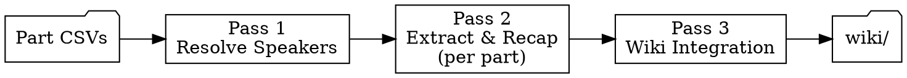

# Pass Architecture (Detailed)

Step-by-step procedure for each of the three passes in the session-ingest
pipeline, plus the file formats (recap, handoff, combat-summary) and the
final-part wrap-up. SKILL.md carries the high-level flow; this file carries the
per-pass detail that loads on demand.



Three passes, not four. Parts are processed directly — no assembly step.

---

## Pass 1: Resolve Speakers

**Requires agent judgment.** Read `references/speaker-resolution.md`.

Input: all `session{NN}-part*.m4a.csv` files
Output: `speaker-map.md`

Goal: every "Speaker 1", "Speaker N", and "Unknown" label mapped to a known
identity with evidence and confidence.

### Procedure

1. **Quick scan** — grep each part for non-standard speaker labels:
   ```bash
   grep -h 'Speaker' audio/sessions/session{NN}-part*.m4a.csv | \
     cut -d',' -f2 | sort | uniq -c | sort -rn
   ```
   If no Speaker N labels exist (only DM, Delmar, Perrin, Jean Claude,
   Crissdalyn), skip this pass entirely.

2. **Sample context windows** — for each unknown label, read 10–15 lines of
   surrounding context from the raw CSVs. Use conversational flow, process of
   elimination, temporal clustering, and speech patterns per the reference doc.

3. **Build speaker map** — write `speaker-map.md` with the standard table format
   (see reference). Every resolution needs a confidence level and evidence.

4. **Commit:**
   ```
   fix: resolve speakers for session {NN} transcript
   ```

**Skip condition:** If all speaker labels are known identities, no speaker map
needed. Note this in `progress.txt` line 1: `speakers: all known (no map needed)`

**Checkpoint:** `speaker-map.md` exists with no `unknown` confidence entries
(or skip noted in progress.txt).

---

## Pass 1b: Retrain Voice Profiles

**Automatic — runs after Pass 1 when cold-pass chunks exist.**

Input: `speaker-map.md` + `Inbox/sNN-chunk-*.md` + corresponding WAVs
Output: Updated voice profiles in `~/.config/shattered-audio/profiles/`

Speaker corrections from Pass 1 are wasted if they don't improve future
sessions. This step feeds them back into the voice profile system so the
live transcription produces fewer UNKNOWN labels next time.

### Prerequisite Check

Cold-pass chunks must exist in `Inbox/` from the same session. Check:

```bash
ls Inbox/s{NN}-chunk-*.md Inbox/s{NN}-chunk-*.wav 2>/dev/null
```

If no chunks exist (session was transcribed offline only, not via live
capture), skip this step — there's no timestamped audio to retrain from.

### Procedure

1. **Build the label map.** The speaker-map.md from Pass 1 resolves CSV
   labels (`Speaker 1`, `Speaker N`). The cold-pass chunks use a different
   label space (`UNKNOWN_1`, `UNKNOWN_N`). Check which UNKNOWN labels in the
   chunks correspond to the same speakers resolved in the speaker-map.
   Add any additional UNKNOWN→identity mappings to the speaker-map's
   resolution table under a `### Cold-Pass Labels` section:

   ```markdown
   ### Cold-Pass Labels

   | Label | Resolved To | Confidence | Evidence |
   |---|---|---|---|
   | UNKNOWN_1 | Crissdalyn | high | Same speaker as CSV "Speaker 1" — temporal overlap, complementary gaps |
   | UNKNOWN_3 | Perrin | medium | Process of elimination — only unaccounted player |
   ```

2. **Run retrain with the speaker-map.** For each chunk that had UNKNOWN
   labels:

   ```bash
   shattered-audio retrain Inbox/s{NN}-chunk-001.md \
     --speaker-map audio/sessions/session{NN}/speaker-map.md \
     --audio-dir Inbox/ --blend 0.7
   ```

   The `--speaker-map` flag reads the resolution table and remaps UNKNOWN
   labels during parsing — no manual find-replace needed.

3. **Verify profile updates.**

   ```bash
   shattered-audio profiles
   ```

   Confirm updated sample counts for the resolved speakers.

4. **Commit:**
   ```
   fix: retrain voice profiles from session {NN} speaker corrections
   ```

### Skip Conditions

- No cold-pass chunks in `Inbox/` for this session
- Pass 1 was skipped (all speakers already known — profiles are already good)
- All UNKNOWN labels in chunks were short utterances (<2s) with no
  reliable audio to train from

**Checkpoint:** `shattered-audio profiles` shows updated sample counts, or
skip reason noted in `progress.txt`.

---

## Pass 2: Extract & Recap (One Part Per Agent)

**Requires agent judgment.** Read `references/extraction-targets.md`.

Input: raw part CSV + `speaker-map.md` (if exists) + `wiki/hot.md` (for context)
Output: `recap.md` + `extracts.md` + `flags.md` (all cumulative)

**Each agent processes exactly one part file, commits, writes a handoff, and
stops.** The next agent picks up from the handoff. No wiki writes happen here.

### Before Your First Line of Work

Read these files (skip any that don't exist yet):
- `progress.txt` — which parts are done
- Tail of `recap.md` — last 2 scenes for continuity
- `flags.md` — any open flags
- `speaker-map.md` — speaker resolutions to apply

### Processing One Part

1. **Identify your part.** Check `progress.txt` — the last entry names the last
   completed part. Your part is the next one numerically. If `progress.txt`
   doesn't exist, start with part00.

2. **Read the part CSV.** Read the full file — parts are sized for one agent's
   context window. Also read the last ~20 lines of the previous part for
   continuity (if not part00).

3. **Apply speaker map.** As you read, mentally replace Speaker N labels per
   `speaker-map.md`. Prefix uncertain resolutions with `?` in your extracts.

4. **Classify lines** — IC (in-character), OOC (out-of-character), or META
   (rules talk, dice rolls). Use surrounding context, not just speaker labels.
   A real-world tangent is OOC even when spoken by a character-labeled speaker.

5. **Merge fragments.** Consecutive lines from the same speaker with no
   intervening speaker → single utterance. The transcription tool splits
   sentences across many 1-second lines.

6. **Identify scenes.** Scene breaks: location change, significant time skip,
   major topic shift, new NPC entrance. Label each with location and
   participants. A scene started in a previous part may continue into this one —
   check the recap tail for the active scene.

7. **Extract canon per scene.** Use the tag types in `extraction-targets.md`.
   Every extract cites the part number and original CSV line IDs:
   `Source: part{PP} lines {start}–{end}`

8. **Flag uncertainties.** Ambiguous canon, transcription errors with lore
   significance, speaker-dependent meaning → append to `flags.md`.

9. **Append to `recap.md`** — condensed IC-only scene summaries.

10. **Append to `extracts.md`** — tagged extracts with citations.

11. **Record progress:**
    ```
    part{PP}: {line_count} lines ({YYYY-MM-DD})
    ```

12. **Commit:**
    ```
    ingest: session {NN} transcript chunk {N} (part{PP})
    ```

13. **Write handoff and stop.** Overwrite `handoff.md` with current state, then
    **stop — do not process the next part.**

### Scene Continuity Across Parts

A scene often spans multiple parts. When the previous recap's last scene is still
active at the start of your part:
- Do NOT create a new scene heading — append to the existing scene
- In `recap.md`, note the continuation: update the scene's participant list and
  extend the summary
- In `extracts.md`, add new extracts under the same scene heading

When the scene does end mid-part, close it and start a new scene heading as
normal.

### Recap Format

```markdown
# Session {NN} Recap

Source: audio/sessions/session{NN}-part*.m4a.csv
Extraction date: {YYYY-MM-DD}

---

## Scene 1: {Location} — {Brief label}
*Part {PP} | {Participants}*

{1–3 sentences of what happened in-game. Factual, not narrative. Name NPCs
and PCs on first mention. Note items exchanged, decisions made, information
revealed.}

---

## Scene 2: ...
```

The recap reads like a concise event log — every consequential in-game event
without OOC or mechanical details. Combat gets outcome and consequences, not
blow-by-blow.

### Handoff Format

Overwrite `handoff.md` after every part. The next agent reads ONLY this file
to orient — make it self-contained.

```markdown
# Session Ingest Handoff — Session {NN}

## Status
- Parts completed: {list, e.g. 00–05}
- Parts remaining: {list, e.g. 06, 07, 08}
- Last scene in recap: "{scene label}"
- Open flags: {count}

## Next Action
Process part{PP} of session {NN} transcript using the `session-ingest` skill.

## Context for Next Part
{3–5 sentences: what was happening at the end of this part — the active scene,
who was talking, any thread mid-conversation. If something important is about
to happen in the next part (you can tell from trailing context), mention it.
Enough for the next agent to maintain perfect continuity.}

## Files to Read First
- `audio/sessions/session{NN}/progress.txt` — part history
- Tail of `audio/sessions/session{NN}/recap.md` — last 2 scenes for continuity
- `audio/sessions/session{NN}/flags.md` — open flags
- `audio/sessions/session{NN}/speaker-map.md` — speaker resolutions
```

### Final Part

When you finish the last available part:
- Verify `recap.md` covers the full session with no gaps between parts
- Verify `extracts.md` has tagged entries for every recap scene
- If any `[COMBAT]` blocks exist in `extracts.md`, compile them into
  `combat-summary.md` (see format below)
- Review `flags.md` — present unresolved items to the DM
- Write `handoff.md` indicating Pass 2 is complete and Pass 3 (wiki) is next
- If combat data was extracted, add to handoff:
  `Combat data available — run pc-combat-primer to update affected profiles.`
- Commit:
  ```
  ingest: complete session {NN} transcript extraction and recap
  ```

### combat-summary.md Format

Compile all `[COMBAT]` blocks from `extracts.md` into a single file optimized
for `pc-combat-primer` consumption. This file is the bridge between ingest and
primer workflows — it saves the primer skill from re-reading raw transcripts.

```markdown
# Session {NN} Combat Summary

Source: audio/sessions/session{NN}/extracts.md
Compiled: {YYYY-MM-DD}
Encounters: {count}

---

## Encounter 1: {name}
{Full [COMBAT] block from extracts.md — header, per-PC table, party state}

---

## Encounter 2: ...
```

---

## Pass 3: Wiki Integration

**Uses existing pipeline.** Load `ttrpg-wiki-ingest` and read its
`references/transcript-ingest.md`. Load `ttrpg-writing` for prose standards.

Input: `recap.md` + `extracts.md` + `flags.md` (resolved)
Output: Wiki file changes

Before starting: verify `flags.md` has no unresolved items that would block
canon. If it does, present flags to the DM and wait.

| Wiki Target | Primary Source |
|---|---|
| Session note (`wiki/sessions/session-{NN}.md`) | `recap.md` scenes |
| Entity pages (NPCs, locations, items) | `recap.md` + `[NPC]`/`[ITEM]` extracts |
| `wiki/dm/combat-analytics.md` | `[COMBAT]` extracts |
| PC combat profiles (`wiki/dm/{pc}-combat-profile.md`) | `combat-summary.md` (via `pc-combat-primer`) |
| `wiki/dm/player-interests.md` | `[SIGNAL]` extracts |
| Situation and faction files | `[CANON]` extracts + `recap.md` |
| `wiki/hot.md` | `recap.md` end state |

Commit:
```
ingest: wiki integration from session {NN} transcript
```

**Checkpoint:** Session note exists and `hot.md` updated date matches.
