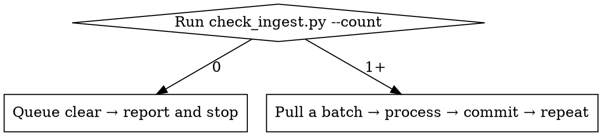

# TTRPG Wiki Ingest

Canon extraction, decomposition, and writeback — not summarization. Identify what is now
true, decide where each fact belongs, update the smallest necessary set of wiki files, and
leave the source traceable.

---

## Entry Point: Run the Script First

Every invocation starts the same way — one command, no reading files yet:

```bash
python3 .claude/scripts/check_ingest.py --count
```

This prunes duplicates (removes Inbox/ files whose bytes already exist in .raw/) and prints
the true pending count. If it pruned tracked files, commit before continuing:

```bash
git add Inbox/ && git diff --cached --quiet || git commit -m "fix: prune already-ingested duplicates from Inbox"
```

**Do not skip this step.** A large Inbox can be 50–70% duplicates. The script is cheap; the
ingest loop is expensive.

---

## Route by Count



### Zero pending

Report "queue clear" and stop. Nothing else to do.

### 1+ pending — pull a batch

```bash
python3 .claude/scripts/check_ingest.py --batch
```

The script fills a batch by token budget (default 30k tokens), walking the queue
smallest-first and stopping when the next file would exceed the budget. It always includes
at least one file. stderr reports the batch size, token count, and how many remain.

Oversized markdown files (over the budget) are automatically chunked by `##` headings into
parts that fit. Each chunk keeps the original frontmatter and is processed as a separate
source. The original is hidden until all chunks are handled.

PDF files are automatically preprocessed into agent-readable markdown before batch assembly.
The script extracts form fields (for D&D character sheets) or page text, writes a structured
`.md` sidecar, and queues the markdown instead of the PDF. The PDF travels alongside the
markdown as a sidecar — it is the player-facing view; the markdown is the agent-optimized
translation. Both are archived together via `archive_source.py`.

1. Read `wiki/hot.md` for current world state.
2. Process each source in the batch to completion (steps below), then archive it.
3. After all sources in the batch: regenerate index, commit once.
4. Run `--batch` again. If output is empty, you're done. Otherwise, repeat from step 2.

For a small queue (1–3 files) this typically finishes in one pass. For a large queue,
read `references/batch-queue.md` for the full orchestration protocol.

---

## Required Skill Chain

Run `ttrpg-llm-wiki-init` once at session start. Load `ttrpg-writing` when you write prose.
Sandbox rules are in CLAUDE.md (always loaded). Operational rules (auto-correct, wikilinks): see `.claude/skills/ttrpg-llm-wiki-init/references/`.

Load domain skills only when the source produces that content:

| Output Needed | Load |
|---|---|
| NPC or crew page | `prep-npc` |
| Location page | `prep-location` |
| Faction page or clock | `prep-faction`, `world-update` |
| Situation with lifecycle | `prep-situation`, `sandbox-narrative` |
| Session note from transcript | `references/transcript-ingest.md` |
| PC character sheet (PDF) | `prep-npc` (for the wiki entity page) |
| Rules/homebrew page | `ttrpg-writing` |

---

## Per-Source Processing

**Your job is this batch. Not the queue.**

Once you pull a batch, the total queue depth is irrelevant. You will never be asked to finish
all 200+ sources in one session — the script handles resumption. What you are asked to do is
ingest each source in this batch at full quality. The 7th source deserves the same reciprocal
links, the same `ingest_packet.py` run, the same reference-file consultation, and the same
decomposition depth as the 1st.

Quality shortcuts that surface under queue pressure — catch yourself:

| Temptation | What actually happens if you yield |
|---|---|
| Skip `ingest_packet.py` ("I know the connections") | Miss existing pages, create duplicate stubs |
| Thin reciprocal links ("minor entity") | Wiki graph becomes sparse and one-directional |
| Skip reference files ("I already know the pattern") | Format drift, missed edge cases |
| Summarize instead of decompose | Claims lose granularity, become un-linkable |
| Stub when source has extractable content | Information buried, never surfaces |
| Vague log/commit messages | Future queries can't find what changed |

None of these save meaningful time. They trade durable wiki quality for the feeling of
progress. The queue shrinks at the same rate either way — one batch per pass.

For every source, regardless of queue depth:

### 1. Read and Classify

Read the source in place (never rewrite it). Load `references/source-triage.md`, classify,
and name expected wiki outputs before writing anything.

For large sources: read headings and frontmatter first, use `rg` for proper nouns and canon
tags, chunk only what's needed.

### 2. Decompose

Run the cross-link map compiler:

```bash
python3 .claude/scripts/ingest_packet.py Inbox/<Source>.md
```

This prints existing pages the source links to (as `slug — summary`) and candidate stubs.
Then read `references/decompose-and-writeback.md` and break the source into durable claims,
giving each claim one canonical home.

### 3. Write Back

Write the smallest useful set of files:

- Preserve existing canon unless the source explicitly supersedes it.
- Keep `summary` ≤ two sentences.
- Use wikilinks for entities, locations, factions, sessions, situations.
- Add reciprocal links when the relationship is durable.
- Add stubs only for concrete referenced entities.
- Update `wiki/hot.md` when current world state changes.

Frontmatter and `updated` are handled by the write hook. Do not hand-edit `wiki/index.md`.

### 4. Archive

```bash
python3 .claude/scripts/archive_source.py Inbox/<Source>.md --type <triage-type>
```

### 5. Finalize (once, after all sources in this pass/batch)

```bash
python3 .claude/scripts/regen_index.py --write
git add wiki .raw Inbox
git commit -m "ingest: <Source A>, <Source B> — <short summary>"
```

Read `references/quality-gates.md` before finalizing. Do not ask for permission to commit
routine ingests.

---

## Reference Files

Read only what the current source needs:

| File | When |
|---|---|
| `references/source-triage.md` | Classifying a new source |
| `references/decompose-and-writeback.md` | Splitting source into wiki pages |
| `references/transcript-ingest.md` | Clean transcript → session canon |
| `references/quality-gates.md` | Before finalizing writes |
| `references/batch-queue.md` | Queue depth 7+ (batch orchestration) |

---

## Source Truth Rules

- Raw source beats generated prose. Flag contradictions unless wiki has a later source.
- Clean reviewed transcript beats raw noise.
- DM instruction in current request beats old source notes.
- Existing wiki canon beats model inference.
- Never add a secret, motive, or consequence because it "fits".

If two facts conflict, append to `wiki/discrepancy-log.md` and escalate to the DM.

---

## Modes and Output

| Mode | Trigger | Action |
|---|---|---|
| `scan` | "what's pending?" | Run script, report removals + count + next source |
| `ingest` | "ingest", "process the inbox" | Dedup → route by depth → process → done |

For `ingest`, process autonomously without asking which source to do first. Pause only for
genuine lore contradictions or ambiguous entity identity.

Output format:

```
Dedup: removed N duplicates | Pending: M
Ingested: <paths> → .raw/<type>/
Created/Updated: <wiki files>
Committed: <message>
Flags: none
```
